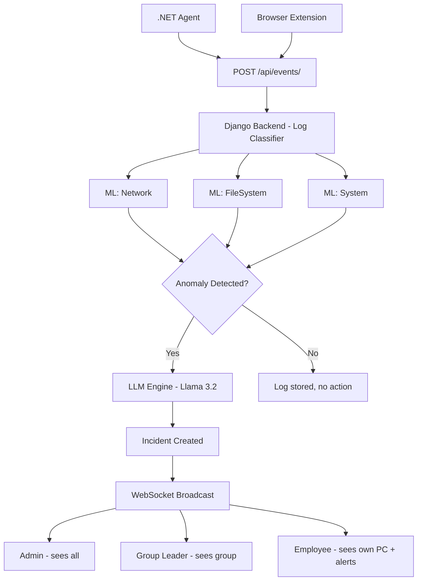

# SMAI Backend — Smart Monitoring and Analysis Infrastructure

  

Central backend for the SMAI project. Built with Django, Django Channels, and Celery.

Handles log ingestion, ML routing, threat detection, real-time alerts, and role-based access control.

  

---

  

## Project Structure

  

```

smai-backend/

├── core/               # Project config (settings, urls, asgi, celery)

├── accounts/           # Users and roles (admin, leader, employee)

├── groups/             # Company groups and leader assignment

├── hosts/              # Machine registration and heartbeat

├── events/             # Incoming logs + ML classifier

├── incidents/          # Threat results + WebSocket alerts

├── manage.py

├── requirements.txt

└── .env

```

  

---
## Architecture Overview

---

  

## Tech Stack

  

| Layer | Technology |

|---|---|

| Web Framework | Django 4.2 |

| REST API | Django REST Framework |

| Auth | JWT (djangorestframework-simplejwt) |

| WebSockets | Django Channels |

| Async Server | Daphne (ASGI) |

| Task Queue | Celery |

| Channel Layer | Redis (InMemory for dev) |

| Database | SQLite (dev) → PostgreSQL (production) |

  

---

  

## Roles

  

| Role | Permissions |

|---|---|

| `admin` | Full access — sees all hosts, groups, incidents. Manages groups and promotes users. |

| `leader` | Sees only their group's hosts and incidents. Cannot manage other groups. |

| `employee` | Sees only their own machine stats. Receives company-wide threat notifications. |

  

---

  

## The Two-Layer AI Pipeline (Part 3)

  

Threat detection works in two sequential steps:

  

**Step 1 — ML Anomaly Detection**

Each log type is routed to a specialized ML model running in parallel:

- Network logs → Isolation Forest trained on network behavior

- File system logs → Isolation Forest trained on file access patterns

- System logs → Isolation Forest trained on process/registry behavior

  

Each model outputs an anomaly score. If the score passes the threshold, the log is flagged and passed to Step 2.

  

**Step 2 — LLM Threat Interpretation**

The flagged anomaly is sent to a small language model (Llama 3.2 1B via Ollama).

The LLM's job is not to detect — the ML already did that.

Its job is to translate the raw technical anomaly into a human-readable incident report

that the SOC admin can understand and act on immediately.

  

```

ML score: -0.87 (anomalous)

          │

          ▼

LLM output: "Process svchost.exe attempted to modify 200 files

             in under 3 seconds with sequential naming patterns.

             This behavior is consistent with ransomware encryption.

             Severity: CRITICAL"

```

  

The backend receives the final combined result from Part 3 and creates an Incident record

which is immediately broadcast to the dashboard via WebSocket.

  

---

  

## Log Classification and ML Routing

  

Every incoming log is classified by its event_type and routed to the correct ML model

via a Celery task. All models run in parallel — a single event can be sent to multiple

models simultaneously if needed.

  

| Event Type | Routed To |

|---|---|

| `network_connection`, `dns_query`, `http_request` | ML: Network |

| `file_created`, `file_modified`, `file_deleted` | ML: FileSystem |

| `process_start`, `process_kill`, `registry_change`, `usb_inserted` | ML: System |

  

The agent gets an immediate HTTP response while all analysis happens in the background.

  

---

  

## Setup (Development)

  

### 1. Clone the repo

```bash

git clone <repo-url>

cd smai-backend

```

  

### 2. Create virtual environment

```bash

python3 -m venv venv

source venv/bin/activate        # Linux/Mac

# venv\Scripts\activate         # Windows

```

  

### 3. Install dependencies

```bash

pip install django djangorestframework djangorestframework-simplejwt channels channels-redis celery daphne

```

  

### 4. Run migrations

```bash

python manage.py makemigrations

python manage.py migrate

```

  

### 5. Create admin user

```bash

python manage.py createsuperuser

```

  

### 6. Start the server — 2 terminals needed

  

**Terminal 1 — ASGI Server**

```bash

daphne -b 0.0.0.0 -p 8000 core.asgi:application

```

  

**Terminal 2 — Celery Worker**

```bash

celery -A core worker --loglevel=info

```

  

Server runs at: `http://localhost:8000`

  

---

  

## Switching to PostgreSQL (Production)

  

1. Install psycopg2: `pip install psycopg2-binary`

2. Update `DATABASES` in `settings.py` to use `django.db.backends.postgresql`

3. Update `CHANNEL_LAYERS` to use `RedisChannelLayer` instead of `InMemoryChannelLayer`

4. Update `CELERY_BROKER_URL` to `redis://localhost:6379/0`

  

---

  

## Team

  

| Part | Responsibility |

|---|---|

| Part 1 | .NET Endpoint Agent |

| Part 2 | Browser Extension |

| Part 3 | ML + LLM Analysis Engine |

| **Part 4** | **This repo — Backend & Data Hub** |

| Part 5 | SOC Dashboard (Frontend) |